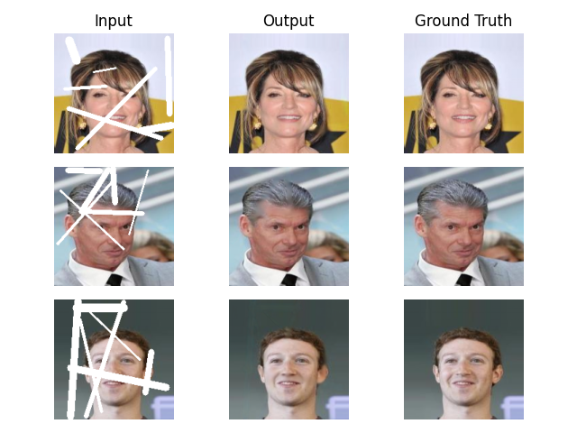
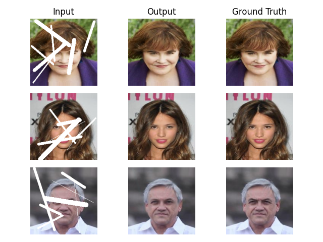

Image inpainting is a fundamental task in computer vision that involves filling in missing
or corrupted regions of an image to restore its visual completeness. It finds applications
in various domains, such as image restoration, object removal, and video editing.

We implemented UNET based deep learning model for the task and trained the model on celebA dataset.
The results of our model is shown below on CelebA dataset.

The detailed report on the project can be obtained in the [report](./MajorReport.pdf).
